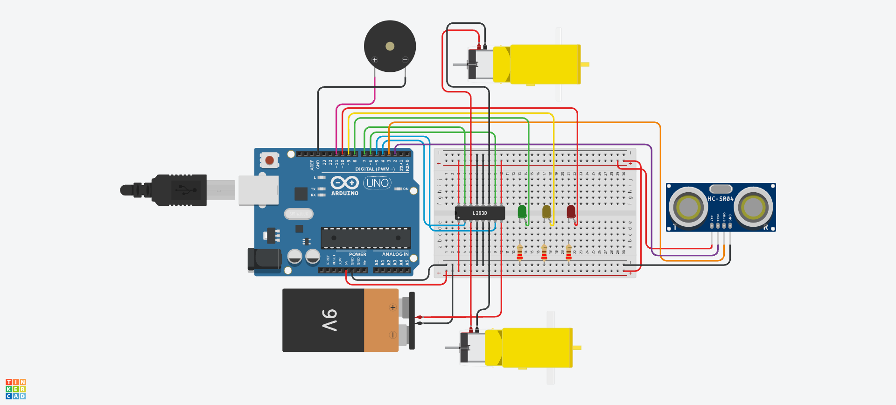

# Carro Robótico Autônomo com Sensor Ultrassônico

> **Projeto Prático de Sistemas Embarcados (Arduino Uno)**
> _Navegação autônoma e desvio de obstáculos com sensor de distância ultrassônico HC-SR04 e tração diferencial via Ponte H L293D._

## Contexto Acadêmico

Este repositório contém a solução desenvolvida para a **atividade prática proposta pelo professor**. O objetivo do exercício foi criar um carro robótico autônomo utilizando o simulador **Tinkercad**, capaz de navegar e desviar de obstáculos respondendo ativamente às leituras de um sensor de distância ultrassônico, consolidando os seguintes conceitos obrigatórios da disciplina:

- Mensuração e processamento temporal de sinais ultrassônicos (Tempo de Voo - ToF) via temporização de precisão (`pulseIn()`).
- Acionamento bidirecional de motores de corrente contínua (CC) através de circuito integrado driver Ponte H (`L293D`).
- **Desafio Técnico:** Implementação de cinemática diferencial com máquina de estados finitos determinística, delimitando zonas de navegação livre, desvio evasivo e frenagem com recuo de emergência.

## 1. O Problema e o Contexto Operacional

Veículos Guiados Automaticamente (AGVs) e plataformas móveis autônomas demandam sistemas de percepção espacial capazes de detectar descontinuidades e obstáculos no percurso em tempo real. A ausência de resposta tempestiva pode resultar em impactos mecânicos, danos estruturais à carga ou travamento da trajetória do robô.

Este projeto fornece uma camada embarcada de controle reativo em malha fechada. O microcontrolador ATmega328P afere periodicamente a distância à frente utilizando um sensor ultrassônico HC-SR04. A partir dos limiares de segurança pré-estabelecidos, o sistema governa a ponte H L293D para modular a rotação dos motores esquerdo e direito, comutando automaticamente entre marcha à frente, giro sobre o próprio eixo para contorno de obstáculos e marcha a ré com aviso sonoro para desobstrução de áreas confinadas.

## 2. Matriz de Estados e Regras de Disparo

A classificação da distância linear ($d$) lida pelo sensor ultrassônico rege o comportamento dos atuadores mecânicos, visuais e sonoros de forma determinística:

| Condição de Proximidade | Faixa de Distância ($d$)                | Estado Operacional | Motor Esquerdo | Motor Direito | LED Verde (D8) | LED Amarelo (D9) | LED Vermelho (D10) | Buzzer (D11) | Ação Cinemática                        |
|:------------------------|:----------------------------------------|:-------------------|:---------------|:--------------|:---------------|:-----------------|:-------------------|:-------------|:---------------------------------------|
| **Pista Desobstruída**  | $d \ge 30.0\text{ cm}$                  | `LIVRE`            | **Frente**     | **Frente**    | **LIGADO**     | Desligado        | Desligado          | Silencioso   | Avanço retilíneo contínuo              |
| **Zona de Atenção**     | $15.0\text{ cm} \le d < 30.0\text{ cm}$ | `DESVIO`           | **Ré**         | **Frente**    | Desligado      | **LIGADO**       | Desligado          | Silencioso   | Giro diferencial no eixo (desvio)      |
| **Proximidade Crítica** | $d < 15.0\text{ cm}$                    | `CRITICO`          | **Ré**         | **Ré**        | Desligado      | Desligado        | **LIGADO**         | **ATIVO**    | Parada imediata e recuo em marcha a ré |

> [!NOTE]
> **Estabilidade Operacional e Amostragem Temporal:**
> As leituras ultrassônicas são processadas em ciclos fixos de $100\text{ ms}$ através da função de temporização não bloqueante `millis()`. Um timeout seguro de $25.000\ \mu\text{s}$ no pulso de eco garante que o microcontrolador não fique retido em caso de reflexão acústica difusa ou ausência de anteparos reflexivos.

## 3. O Desafio Técnico: Cinemática de Evasão e Sensoriamento Acústico

### 3.1 Cálculo da Distância por Tempo de Voo (_Time of Flight_)

O sensor ultrassônico HC-SR04 não mede a distância diretamente; ele mede o **tempo** que o som leva para ir até o obstáculo e voltar:

1. **Trigger (Saída D2):** O Arduino envia um pulso de disparo de $10\ \mu\text{s}$, fazendo o sensor emitir 8 pulsos de ultrassom a 40 kHz.
2. **Echo (Entrada D3):** O pino Echo fica em nível alto (`HIGH`) enquanto o som viaja pelo ar e volta. A função `pulseIn()` mede essa duração ($\Delta t$) em microssegundos.

Como a onda sonora faz o percurso de **ida e volta**, a distância real até o objeto é a metade do caminho percorrido pelo som:

$$\text{Distância} = \frac{\text{Velocidade do Som} \times \text{Tempo}}{2}$$

Considerando a velocidade do som no ar ($v \approx 343\text{ m/s} = 0{,}0343\text{ cm/}\mu\text{s}$):

$$d\text{ (cm)} = \frac{0{,}0343 \cdot \Delta t}{2} \approx \frac{\Delta t}{58{,}3}$$

- $\Delta t$: Tempo de eco em microssegundos ($\mu\text{s}$).
- $58{,}3$: Constante prática de conversão ($\frac{2}{0{,}0343}$).

### 3.2 Dinâmica de Tração Diferencial (Manobras 2WD)

O chassi de tração diferencial controla a direção do carro alternando os sentidos de rotação das duas rodas motrizes:

- **Avançar em Linha Reta ($d \ge 30.0\text{ cm}$):** Ambos os motores giram para frente em velocidade máxima.
- **Giro sobre o Próprio Eixo ($15.0\text{ cm} \le d < 30.0\text{ cm}$):** O motor esquerdo gira para trás e o direito para frente, permitindo que o carro contorne o obstáculo com raio de curva nulo.
- **Frenagem e Marcha a Ré ($d < 15.0\text{ cm}$):** Ambos os motores revertem a rotação simultaneamente para afastar o veículo da colisão, acompanhado do aviso sonoro do buzzer.

## 4. Pinout e Conexões do Circuito (Hardware)

O circuito foi desenvolvido para o **Arduino Uno R3**, com alocação contígua e organizada dos pinos de controle de `D2` a `D11`:

| Componente                     | Pino Arduino | Tipo de I/O     | Função no Sistema                                        | Montagem Tinkercad                      |
|:-------------------------------|:-------------|:----------------|:---------------------------------------------------------|:----------------------------------------|
| **Sensor Ultrassônico (Trig)** | `D2`         | Saída Digital   | Disparo do trem de pulsos de 10 µs                       | Terminal Trigger do HC-SR04             |
| **Sensor Ultrassônico (Echo)** | `D3`         | Entrada Digital | Recepção do tempo de retorno do eco                      | Terminal Echo do HC-SR04                |
| **Ponte H L293D (IN1)**        | `D4`         | Saída Digital   | Motor Esquerdo - Polaridade Direta                       | Pino 2 do CI L293D (Entrada 1)          |
| **Ponte H L293D (IN2)**        | `D5`         | Saída Digital   | Motor Esquerdo - Polaridade Reversa                      | Pino 7 do CI L293D (Entrada 2)          |
| **Ponte H L293D (IN3)**        | `D6`         | Saída Digital   | Motor Direito - Polaridade Direta                        | Pino 10 do CI L293D (Entrada 3)         |
| **Ponte H L293D (IN4)**        | `D7`         | Saída Digital   | Motor Direito - Polaridade Reversa                       | Pino 15 do CI L293D (Entrada 4)         |
| **LED Verde**                  | `D8`         | Saída Digital   | Indicação de Via Livre ($d \ge 30\text{ cm}$)            | Resistor limitador de 220 Ω no ânodo    |
| **LED Amarelo**                | `D9`         | Saída Digital   | Indicação de Manobra Evasiva ($15 \le d < 30\text{ cm}$) | Resistor limitador de 220 Ω no ânodo    |
| **LED Vermelho**               | `D10`        | Saída Digital   | Indicação de Proximidade Crítica ($d < 15\text{ cm}$)    | Resistor limitador de 220 Ω no ânodo    |
| **Buzzer Piezoelétrico**       | `D11`        | Saída Digital   | Sinal sonoro de alerta e manobra de ré                   | Terminal positivo no D11; GND no cátodo |

### 4.1 Alimentação e Conexão da Ponte H (L293D)

- **Habilitação dos Motores:** Os pinos `Enable 1,2` (pino 1) e `Enable 3,4` (pino 9) são conectados permanentemente ao barramento de `5V` para manter torque e rotação nominais.
- **Alimentação Lógica (`VCC1`, pino 16):** Conectada aos `5V` regulados do Arduino Uno.
- **Alimentação de Potência (`VCC2`, pino 8):** Conectada à fonte dos motores (`5V` do Arduino ou alimentação externa).
- **Referência Comum (`GND`):** Os pinos centrais `4`, `5`, `12` e `13` do CI L293D compartilham o barramento de terra comum do circuito.

### 4.2. Diagrama do Circuito no Tinkercad

Abaixo está a montagem física do hardware simulado no Autodesk Tinkercad, demonstrando as conexões do sensor HC-SR04, driver L293D, motores DC e sinalizadores:

> [!TIP]
> Durante a simulação no Tinkercad, clicar sobre o sensor ultrassônico HC-SR04 abre a interface interativa com o objeto refletor (círculo verde). Ao arrastar o objeto aproximando ou afastando do sensor, é possível observar instantaneamente a comutação de rotação dos motores, a troca dos LEDs de sinalização e a ativação do buzzer conforme a matriz de estados.
